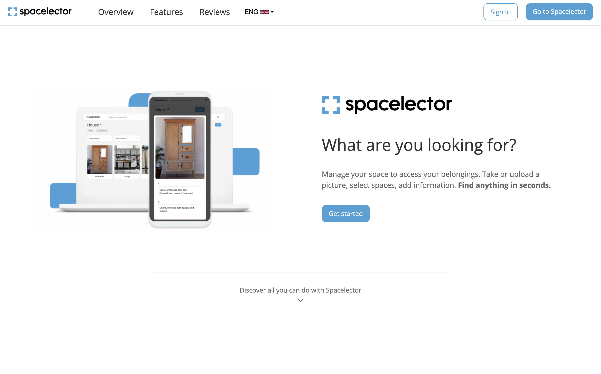
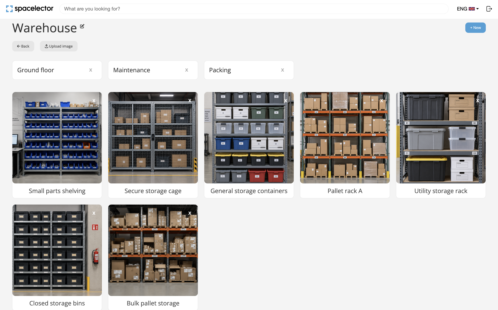
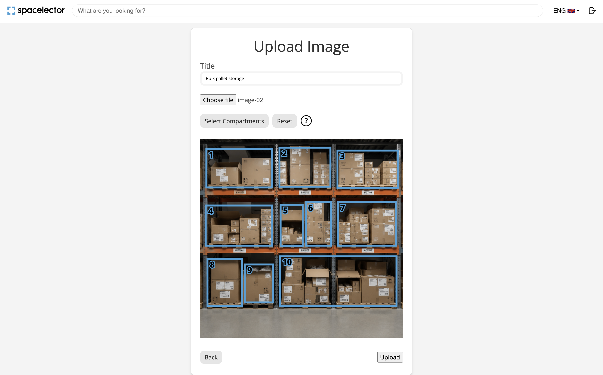
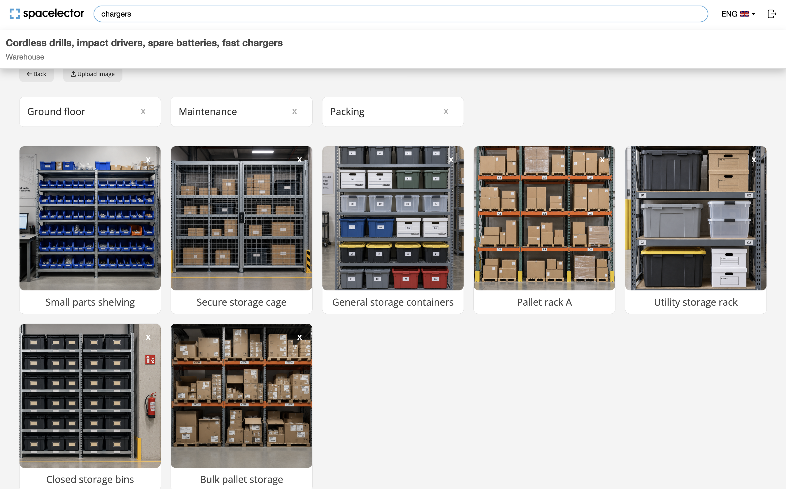
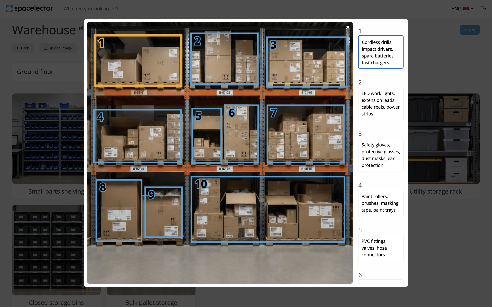

# Spacelector

Spacelector is a visual tool for keeping track of where things are stored. Users create spaces and
subspaces that match the structure of real locations, then upload photos and mark drawers, shelves,
boxes, or other areas as numbered compartments. Each compartment has its own short annotation
describing what is stored there. The navbar search covers spaces, subspaces, photo titles, and
annotations, and opens the relevant image with the matching compartment highlighted.



*Spacelector turns physical storage into a searchable visual map.*

## The problem it solves

"Where did I put the spare fuses?" is usually answered by opening cabinets one at a time.
Spacelector turns that into a search instead:

1. Create a space for a physical place — say, **Warehouse**.
2. Inside it, create subspaces for the areas within it — **Large cabinet**, **Lockers**.
3. Upload a photo of the cabinet, drag a box over each drawer, and jot down what's in each one:
   `screws`, `cables and chargers`, `loose bolts`. These are meant to be typed fast, like a note on
   your phone — abbreviations and small typos are fine, not something to avoid.
4. Weeks later, search for "chargers" and Spacelector opens that photo with the right box
   highlighted, even if you'd typed it as "chargrs" when you saved it.

It's a bit like organizing folders in Google Drive, except the folders are physical places instead
of documents, and instead of dragging in files you're photographing a shelf and marking what's on
it. It's not meant for uploading polished documents or keeping a formal catalogue — the
annotations are closer to a sticky note than an inventory entry, and it's built to be quick to add
to and quick to search, not thorough.



*A warehouse space can contain nested areas and multiple storage photos, mirroring the structure of the real location.*

## Main features

- Email/password authentication, with Google sign-in available if you configure it (see below).
- Nested spaces: a space can contain subspaces, to whatever depth makes sense — a warehouse with
  sections, a cabinet with drawers.
- Upload a photo to any space or subspace, then draw multiple numbered boxes on it directly in
  the browser with mouse or touch, and attach a short note to each one.
- Boxes and their notes persist and reload correctly the next time you open the image.
- Search across space/subspace names, photo titles, and box annotations at once, tolerant of
  accents and small typos, with no external search service or AI API involved.
- Opening a search result jumps straight to the right photo with the matching box highlighted.
- HEIC photos (the default format on iPhones) are converted to JPEG automatically on upload.
- Each user only ever sees and can modify their own spaces, images and annotations.



*Draw numbered regions directly over a photo to map the physical storage areas you want to track.*

## Stack

- Ruby 3.1.2, Rails 7.1.2
- PostgreSQL — also does double duty as the search engine, see below
- Devise for authentication (email/password, plus optional Google OAuth)
- Active Storage for photo uploads: local disk in development/test, S3-compatible object storage
  in production
- Sprockets + `importmap-rails` + Stimulus/Turbo for the frontend; the box-drawing and
  image-viewer canvases are plain JavaScript, no separate build step
- Bootstrap 5 for layout, `simple_form` for forms
- `mini_magick` / `image_processing` for resizing uploads and converting HEIC to JPEG

The `pay` and `stripe` gems are also in the `Gemfile`, with `/checkout` and `/billing` routes
behind them. The original plan was to offer paid plans from the first release, but before
launching it made more sense to ship a free version first — the workflow itself (photographing
storage and drawing regions on it) is unfamiliar enough that adding payment friction on top would
just get in the way of people trying it, giving feedback, and surfacing bugs. That code is still
here as a plausible next step once the core product proves useful, but billing isn't configured
and isn't part of the main workflow — treat it as present, not active.

## Architecture

```
app/
  controllers/   one controller per resource (spaces, images, compartments, object_infos);
                  application_controller.rb has the shared auth + ownership-scoping helper
  models/        User, Space, Image, Compartment, ObjectInfo — see data model below
  services/      SearchService: the exact/fuzzy search logic, kept out of the controller
  views/         ERB templates; the box-drawing canvas and search-result highlighting are
                  plain <script> blocks inside images/new.html.erb and spaces/show.html.erb
  assets/        Sass (via sassc-rails) and the sprockets-era JS/images
db/
  migrate/       schema history
  seed_images/   two small generated placeholder photos used by db/seeds.rb
docs/
  DEPLOYMENT.md  step-by-step production deployment guide
test/
  controllers/, models/    request specs and model tests
  system/                  browser tests (Capybara + Selenium) for JS-driven behavior
```

### Data model

```text
User → Space → Image → Compartment → ObjectInfo
         └── child Spaces
```

- A **Space** belongs to a `User` and, optionally, to a parent `Space`. A top-level space and a
  subspace are the same model — nesting is just a self-join via `parent_space_id`. Deleting a
  space cascades to its subspaces and their images.
- An **Image** belongs to a `Space` and holds the uploaded photo (via `has_one_attached :file`)
  plus a title.
- A **Compartment** belongs to an `Image` and stores the drawn box's pixel coordinates — the
  region, not the text.
- An **ObjectInfo** belongs to a `Compartment` and holds the actual annotation text. Geometry and
  text are saved separately because the canvas only needs to send coordinates when you draw and
  text when you type, and keeping those two save paths independent turned out simpler.

## Search: how it works and its limits

Search runs entirely in Postgres, using `SearchService` (`app/services/search_service.rb`), which
queries space/subspace names, image titles, and annotation text in one pass, scoped to the
signed-in user. Two Postgres extensions do the actual matching:

- `unaccent`, so accented text matches its plain form too (searching "cafe" would find "café").
- `pg_trgm`'s `similarity()`, so a search for "screws" still finds an annotation typed as "scews".



*One search covers spaces, photos and compartment notes; here "chargers" matches a word inside a single compartment's annotation, shown with the space it belongs to.*

Results are ranked so an exact match always beats a substring match, which beats a fuzzy one, and
anything below a similarity threshold is dropped entirely — the goal is to tolerate a typo without
turning search into "return anything vaguely related." That threshold also means very short or
heavily misspelled queries can still come up empty, and there's no stemming (searching "screw"
won't find "screws" unless they're close enough for trigram similarity to catch it on its own).

Clicking a result opens the right place: a space/subspace result opens that space; an image or
annotation result opens the image in its modal with the matching box highlighted and scrolled into
view.



*Opening an annotation result jumps directly to the relevant photo and highlights the matching physical compartment.*

## Storage: what's used where

| Environment | Service | Why |
|---|---|---|
| Development | Local disk (`storage/`) | No cloud account needed to run the app locally |
| Test | Local disk (`tmp/storage/`), separate from dev | Isolated, disposable |
| Production | S3-compatible bucket | The host's filesystem isn't persistent — anything on local disk there is lost on every deploy or restart |

This is controlled by `ACTIVE_STORAGE_SERVICE` (see `config/storage.yml`), defaulting to `local`
in development and `amazon` in production. See [`docs/DEPLOYMENT.md`](docs/DEPLOYMENT.md) for the
production setup and which bucket provider it uses.

Upload limits, for a public demo: 15 MB per file, 200 MB per user in total. Accepted formats:
JPEG, PNG, WEBP, HEIC. Anything else, or anything over the size limit, is rejected with an
explanation on the upload form — no file is silently dropped or partially saved.

## Getting started

### Prerequisites

- Ruby 3.1.2 (a `.ruby-version` file is included, so `rbenv`/`rvm` will pick it up)
- PostgreSQL running locally
- ImageMagick with HEIC support: `brew install imagemagick` on macOS (its Homebrew build includes
  HEIC support by default)

### Setup

```bash
git clone https://github.com/NahuelRibera/spacelector.git
cd spacelector
bundle install
bin/rails db:prepare   # creates the databases (snap_development / snap_test) and loads the schema
bin/rails db:seed      # creates the demo account and sample data
bin/rails server
```

No `.env` file or credentials are needed for any of this. Open `http://localhost:3000` and log in
with the demo account:

| Email | Password |
|---|---|
| `demo@spacelector.app` | `password123` |

### Sample data

`bin/rails db:seed` (`db/seeds.rb`) creates the demo account above with a "Warehouse" space
containing a "Large cabinet" and a "Lockers" subspace, two photos, and a handful of annotations,
including one with a deliberate spelling mistake so you can try the typo-tolerant search right
away. It's idempotent: running it again won't duplicate the account or its data, never deletes
anything, and resets the demo password to `password123` if it was changed. It refuses to run
when `RAILS_ENV=production`, so this publicly known login can't end up on a real deployment.

### Try it

Log in as the demo account (or sign up with any email/password), and:

1. Create a space, e.g. "Warehouse".
2. Inside it, create a subspace, e.g. "Large cabinet".
3. Upload a photo, draw a couple of boxes on it, and click Upload.
4. Click the uploaded image, type a note into each numbered box.
5. Reload the page, click the image again — your boxes and notes are still there.
6. Use the search bar to find what you just typed, typo and all.

The demo account already has steps 1–4 done, so you can go straight to searching.

## Authentication

Authentication is handled by Devise. Email/password sign-up and login always work; signing in
with Google is an optional extra.

### Demo login

`demo@spacelector.app` / `password123` — created by `db/seeds.rb` (see [Sample data](#sample-data)).
It's for local development and demos only.

### Google sign-in (optional)

The app does not need Google OAuth to run. When `GOOGLE_CLIENT_ID` and `GOOGLE_CLIENT_SECRET`
aren't both set, the Google strategy isn't registered, the Google buttons are hidden (the
homepage "Get started" button goes to email sign-up instead), and no request is ever sent to
Google.

To enable it locally:

1. In [Google Cloud Console](https://console.cloud.google.com/) → APIs & Services → Credentials,
   create an **OAuth client ID** of type **Web application** (use your own; this repository ships
   no credentials).
2. Add the **Authorized redirect URI**:

   ```
   http://localhost:3000/users/auth/google_oauth2/callback
   ```

   and the **Authorized JavaScript origin**:

   ```
   http://localhost:3000
   ```

3. Copy `.env.example` to `.env` and fill in the two values:

   ```bash
   cp .env.example .env
   ```

   ```
   GOOGLE_CLIENT_ID=your-client-id.apps.googleusercontent.com
   GOOGLE_CLIENT_SECRET=your-client-secret
   ```

4. Restart the server. `.env` is read at boot by `dotenv-rails` in development and test.

`.env` is excluded from Git by `.gitignore`, so your credentials stay on your machine;
`.env.example` is the committed template and contains no secrets — never put real values there.

The callback URL is built from the host and port the app is actually served on, so it must match
what's registered in Google Cloud exactly. If you run Rails on another port, for example:

```bash
bin/rails server -p 3001
```

then register `http://localhost:3001/users/auth/google_oauth2/callback` as the redirect URI (and
`http://localhost:3001` as the JavaScript origin) as well. A mismatch shows up on Google's side as
`redirect_uri_mismatch`. For production, set the same two variables in the host's environment and
register your production callback URL — see [`docs/DEPLOYMENT.md`](docs/DEPLOYMENT.md).

## Tests

```bash
bundle exec rails test
```

Covers space creation and reopening (including nested subspaces), image upload with its
compartments' coordinates, annotation create/update, exact and fuzzy search — both through
`SearchService` directly and through the search endpoints — that a search result opens the right
image with the right box, email/password login and that Google sign-in is only offered when
it's configured, and, repeated across most of the above, that one user can never read,
modify, or delete another user's spaces, images, or annotations by guessing an id in the URL.

There's also one browser test (`bundle exec rails test:system`, needs a local Chrome install)
covering a specific bug where reopening a previously-viewed image could show a stale picture next
to the right annotation — it drives the actual modal in a real browser and checks the canvas
pixels, not just the DOM. The rest of the JavaScript — drawing boxes with mouse and touch, resizing
— was checked manually rather than automated.

## Deployment

See [`docs/DEPLOYMENT.md`](docs/DEPLOYMENT.md) for the full guide: a Render web service with a
managed Postgres database, an S3-compatible bucket for photos, the environment variables
production needs, and connecting a custom domain with HTTPS.

## Status and known limitations

- Core workflow — sign up, nested spaces, upload, draw boxes, annotate, search, isolation between
  users — is implemented and covered by the test suite above.
- Not deployed yet. `docs/DEPLOYMENT.md` describes how to; there's no live URL at the moment.
- The subscription/billing code (`pay`, `stripe`, `/checkout`, `/billing`) is present but
  unconfigured, as explained above.
- Mobile layout relies on the extensive set of device-specific media queries already in
  `app/assets/stylesheets/spaces/_show.scss` and `_navbar.scss`; this update didn't redesign them,
  and touch-drawing and reopening the modal were checked on a resized viewport, not on a range of
  real physical devices.
- No license file is currently included in this repository.

## Credits

- [Nahuel Ribera](https://github.com/NahuelRibera)
- [Martí Carmona](https://github.com/MartiCarmona)

Originally built collaboratively by Nahuel Ribera and Martí Carmona. Nahuel later revisited the
project, improved several features, debugged the storage and image-viewer workflows, and prepared
this version for republication on GitHub and a future public demo.
